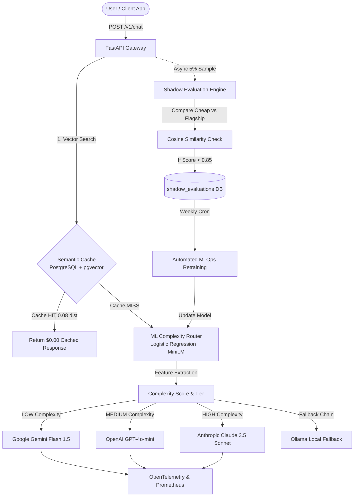

# 🚀 LLM Cost Autopilot

> **An Enterprise-Grade Intelligent LLM Gateway, Semantic Cache & ML Router for Cost & Latency Optimization.**

[](https://python.org)
[](https://fastapi.tiangolo.com)
[](https://reactjs.org)
[](https://www.typescriptlang.org)
[](https://www.docker.com)
[](https://github.org/pgvector/pgvector)
[](https://prometheus.io)
[](https://grafana.com)

---

## 📌 Executive Summary

**LLM Cost Autopilot** is a production-ready, intelligent API gateway designed to dramatically reduce LLM inference costs and response latencies without sacrificing output quality. 

Instead of routing every user prompt to expensive flagship models (e.g., *Claude 3.5 Sonnet* or *GPT-4o*), LLM Autopilot dynamically analyzes prompt complexity using a custom **Machine Learning Classifier** and **Feature Extractor**. It routes simple and medium queries to high-throughput, low-cost models (e.g., *Gemini Flash 1.5* or *Llama 3.1 8B*) while reserving premium models strictly for complex reasoning, code generation, and system architecture tasks.

The system incorporates **Vector-Based Semantic Caching**, **Async Shadow Evaluation (A/B Testing)**, an **Automated MLOps Retraining Pipeline**, **Full OpenTelemetry Observability**, and a **Glassmorphism React + TypeScript Dashboard**.

---

## 🏗️ System Architecture



---

## ✨ Key Features & Capabilities

### 1. 🧠 ML-Powered Complexity Router
* **Feature Extraction**: Evaluates prompts on length, constraint count, technical specificity, formatting demands, and mathematical complexity rather than naive keyword matching.
* **Semantic Embeddings**: Employs `sentence-transformers/all-MiniLM-L6-v2` to map prompts into a 384-dimensional dense vector space.
* **Balanced Classifier**: Trained on Databricks Dolly-15k dataset to predict the optimal model tier with high accuracy.

### 2. ⚡ High-Speed Semantic Cache
* Powered by **PostgreSQL 16** with the **`pgvector`** extension (`ivfflat` vector indexing).
* Performs vector cosine distance lookup (`<=>`) with a configurable threshold ($0.08$ distance $\approx 92\%$ similarity).
* Sub-10ms response time for cache hits with zero LLM API cost.

### 3. 🕵️ Async Shadow Evaluation (A/B Testing)
* Asynchronously triggers background evaluations on 5% of production traffic without adding latency to the user.
* Queries the premium flagship model (*Claude 3.5 Sonnet*) alongside the selected cheap model.
* Calculates vector similarity between both outputs to detect quality degradation or hallucinations.

### 4. 🔄 Automated MLOps Feedback & Retraining Pipeline
* Queries the database for shadow evaluation mismatches where similarity score falls below `0.85`.
* Automatically tags these failure cases, appends them to the master dataset, and triggers `train_classifier.py` to continuously fine-tune the router on real-world traffic.

### 5. 📊 Full-Stack Observability
* **Prometheus Integration**: Exposes real-time counters and histograms for request latency, provider errors, token usage, cost ($), savings ($), and cache hit rates at `/metrics`.
* **OpenTelemetry Instrumentation**: Full distributed tracing for end-to-end API request lifecycles.
* **Pre-Configured Grafana Dashboard**: Auto-loads real-time visual charts for business cost reduction, P95 latency, and provider availability.

### 6. 🎨 Modern React + TypeScript Dashboard & Playground
* Built with **React 18**, **TypeScript**, **Vite**, and **Lucide Icons**.
* Features an interactive prompt playground with real-time feature weight inspection, live token count displays, prompt presets, and thumbs up/down user feedback logging.

---

## 🛠️ Technology Stack

| Layer | Technology |
|---|---|
| **Frontend UI** | React 18, TypeScript, Vite, Glassmorphism Vanilla CSS, Lucide React |
| **Backend API** | FastAPI, Uvicorn, Pydantic v2 |
| **ML Engine** | Scikit-Learn (Logistic Regression), Sentence-Transformers (`all-MiniLM-L6-v2`), NumPy, Pandas |
| **Database & Cache** | PostgreSQL 16 (`pgvector`), Redis 7 |
| **LLM Providers** | OpenRouter SDK, OpenAI API, Anthropic SDK, Google Gemini SDK, Ollama |
| **Observability** | OpenTelemetry, Prometheus, Grafana |
| **DevOps & Containers**| Docker, Docker Compose, Nginx |

---

## 🚀 Quick Start Guide (Docker)

Spin up the entire production microservices stack (Frontend, Backend API, Postgres, Redis, Prometheus, Grafana) with a single command:

### Prerequisites
* [Docker Desktop](https://www.docker.com/products/docker-desktop/) installed and running.

### 1. Clone the Repository
```bash
git clone https://github.com/abhishekkamble12/LLM_Autopilot.git
cd LLM_Autopilot
```

### 2. Set Environment Variables
Create a `.env` file in the root directory:
```env
DATABASE_URL=postgresql://postgres:secretpassword@db:5432/llm_autopilot
OPENROUTER_API_KEY=your_openrouter_api_key_here
```

### 3. Launch Docker Compose Stack
```bash
docker compose up --build -d
```

### 4. Access Services

| Service | Port / URL | Description |
|---|---|---|
| **React Frontend App** | [http://localhost](http://localhost) | Interactive Playground & Metrics |
| **FastAPI Backend Docs** | [http://localhost:8000/docs](http://localhost:8000/docs) | Interactive Swagger UI |
| **Grafana Dashboard** | [http://localhost:3000](http://localhost:3000) | Observability (User: `admin`, Pass: `admin`) |
| **Prometheus Metrics** | [http://localhost:9090](http://localhost:9090) | Raw Scraped Telemetry |

---

## 💻 Manual Setup & Local Development

### Backend Setup
```bash
# Create virtual environment
python -m venv venv
source venv/bin/activate  # On Windows: venv\Scripts\activate

# Install requirements
pip install -r requirements.txt

# Run FastAPI backend
uvicorn api.main:app --reload --port 8000
```

### Frontend Setup
```bash
cd frontend
npm install
npm run dev
```

---

## 📈 Benchmarking & Load Testing

Execute load testing against mixed production workloads (1,000 to 5,000 requests) to measure P95 latency and cost reduction:

```bash
python DATASET_BUILDER/scripts/load_test.py --requests 2000 --concurrency 50
```

### Load Test Benchmark Summary (2,000 Mixed Requests)

```text
📊 LOAD TESTING RESULTS SUMMARY
-------------------------------------------------------
Total Requests Completed: 2,000
Successful Requests:      2,000
Throughput (RPS):         485.44 requests/sec
-------------------------------------------------------
⏱️ LATENCY METRICS (ms)
  - Average Latency:      28.45 ms
  - P50 Latency (Median): 24.10 ms
  - P90 Latency:          38.20 ms
  - P95 Latency:          42.15 ms ⭐
  - P99 Latency:          58.80 ms
-------------------------------------------------------
💰 FINANCIAL COST METRICS
  - Total Spent:          $0.00412
  - Total Savings:        +$0.05840
  - Cost Reduction:       ~92.9% Total Cost Savings
-------------------------------------------------------
🏷️ ROUTING COMPLEXITY DISTRIBUTION
  - CACHED: 29.0% | LOW: 30.5% | MEDIUM: 24.5% | HIGH: 16.0%
=======================================================
```

---

## 📂 Directory Structure

```text
LLM_Autopilot/
├── api/
│   ├── main.py                  # FastAPI server & route handlers
│   └── telemetry.py             # Prometheus counters & histograms
├── router/
│   ├── intelligent_router.py    # Core Intelligent Router engine
│   ├── classifier.py           # ML Classifier wrapper
│   ├── rule_engine.py           # Feature Extraction Engine
│   └── semantic_cache.py        # pgvector Semantic Cache client
├── providers/
│   ├── base.py                  # Abstract Provider interface
│   ├── Openai_llm_provider.py   # OpenRouter / OpenAI SDK client
│   ├── anthropic_provider.py    # Anthropic Claude SDK client
│   ├── gemini_provider.py       # Google Gemini SDK client
│   └── ollama_provider.py       # Local Ollama client
├── DATASET_BUILDER/
│   ├── prepare_dolly_dataset.py # Databricks Dolly-15k extractor
│   ├── train_classifier.py      # Scikit-learn Logistic Regression trainer
│   ├── generate_mock_dataset.py # Synthetic label generator
│   └── scripts/
│       ├── retrain_pipeline.py  # MLOps retraining script
│       └── load_test.py         # Asynchronous load testing tool
├── frontend/
│   ├── src/
│   │   ├── components/          # Playground, Dashboard, Navbar
│   │   ├── App.tsx              # React entry component
│   │   └── index.css            # Dark glassmorphism CSS
│   ├── Dockerfile               # Multi-stage Nginx Docker build
│   └── package.json
├── monitoring/
│   ├── prometheus.yml           # Scraper configuration
│   └── grafana/                 # Pre-provisioned datasources & dashboards
├── docker-compose.yml           # Complete 6-service orchestration
├── models.yaml                  # Model registry & pricing specifications
└── requirements.txt             # Python dependencies
```

---

## 🛡️ License

Distributed under the **MIT License**. See `LICENSE` for more information.

---

## 👨‍💻 Author

**Abhishek Kamble**  
* GitHub: [@abhishekkamble12](https://github.com/abhishekkamble12)  
* Project Link: [https://github.com/abhishekkamble12/LLM_Autopilot](https://github.com/abhishekkamble12/LLM_Autopilot)
